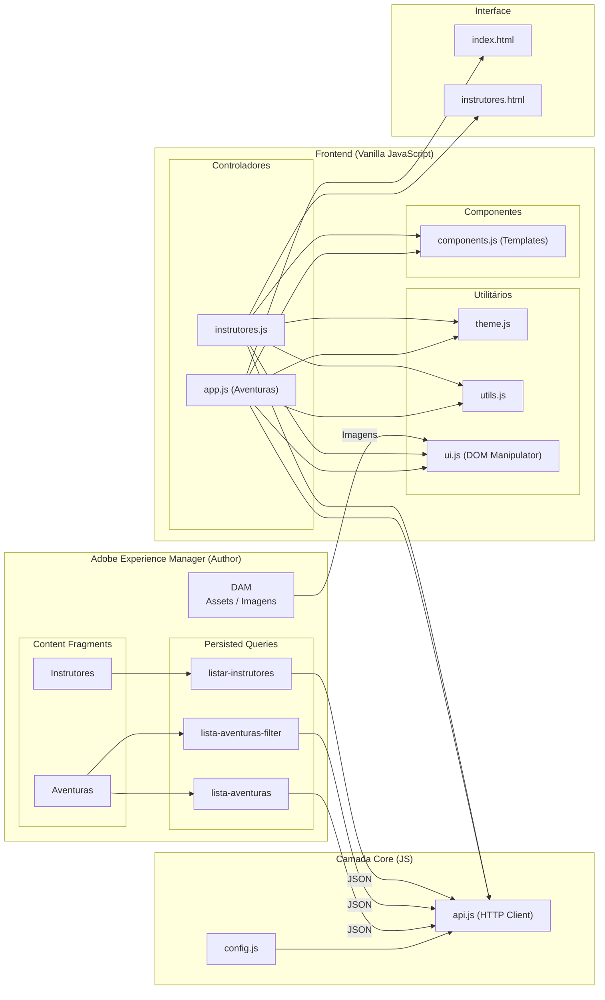

# WKND Adventures (Desafio 8.2) — Vitrine Headless

Aplicação web desacoplada (Headless Frontend) desenvolvida em **HTML5, CSS3 e JavaScript moderno puro (Vanilla ES6 Modules)** para consumir e renderizar o ecossistema de aventuras e instrutores do **Adobe Experience Manager (AEM)** utilizando **GraphQL Persisted Queries**.

---

## 1. Introdução e Visão Geral

### O Propósito da Vitrine

O foco central do **Desafio 8.2** é criar uma ponte totalmente isolada entre o front-end e o AEM. Em vez de utilizar as tradicionais páginas gerenciadas pelo Sling, nós desenvolvemos um portal autônomo. Esta vitrine independente lê e apresenta o catálogo de aventuras consumindo exclusivamente respostas JSON do AEM (via GraphQL Persisted Queries), provando na prática o imenso poder do conceito **Headless**.

### O Papel do AEM (Backend as a Service)

Neste paradigma arquitetural, o AEM abandona a responsabilidade visual (HTML/CSS) e abraça a vocação de **Repositório Central de Dados**:

- **Autoria de Dados Estruturados:** Os autores usam os *Content Fragments* para inserir e gerenciar as Aventuras e os perfis dos Instrutores.
- **Distribuição (API):** Em vez de montar páginas web, o AEM abre portas (Endpoints RESTful de Persisted Queries) para servir esse conteúdo puro.
- **Total Independência Front-end:** Graças à entrega em formato JSON agnóstico e links diretos para os ativos digitais (DAM), a aplicação final consome os dados livremente.

### O que foi desenvolvido

A aplicação evoluiu para um sistema modular, responsivo e de alta performance, contendo:

1. **Catálogo de Aventuras (`index.html`)**: Vitrine inicial com grid dinâmico e filtros em tempo real por nível de dificuldade, consumindo dados do AEM sem recarregamento da página (SPA feel).
2. **Equipe de Instrutores (`instrutores.html`)**: Página dedicada para apresentar os guias WKND, listando nomes, fotos nativas do AEM (DAM) e anos de experiência, com busca inteligente via JavaScript.
3. **Modal de Detalhes Unificado e Inteligente**: Componente interativo que adapta seu layout dinamicamente dependendo se a entidade clicada é uma Aventura ou um Instrutor (aplicando recortes fotográficos avançados via IA e CSS).
4. **Carregamento Nativo Anti-CORS**: Utilitário engenhoso que renderiza imagens protegidas do DAM do AEM de forma nativa (`img.src`), absorvendo a sessão de cookies e evitando os erros clássicos de bloqueio CORS do `fetch()`.
5. **Otimizações Extremas de LCP (Lighthouse)**: Aplicação de Resource Hints como `<link rel="preload">` e `<link rel="preconnect">` para adiantar o download de imagens críticas, alcançando nota 100 em Best Practices e SEO.

---

## 2. Objetivos e Critérios de Aceite

Abaixo estão listados os critérios oficias de conformidade estabelecidos para o desafio, devidamente cumpridos e evidenciados nesta documentação:

- [x] **App externo renderizando dados reais do AEM via persisted query:** Integração completa consumindo as persisted queries nativas do AEM (ex: `wknd/lista-aventuras`).
- [x] **Filtro funcionando via parâmetro de persisted query:** Passagem nativa de parâmetros (ex: `;dificuldade=facil`) diretamente na URL da query persistida.
- [x] **Ciclo editar->publicar->refletir comprovado:** Validação completa do fluxo de alteração de um Content Fragment (ex: Nome de um Instrutor) refletindo imediatamente e de forma dinâmica na interface (comprovado nas evidências).
- [x] **Nenhuma query montada por concatenação de string no cliente:** Estrita conformidade estrutural. Todas as chamadas GraphQL transitam via requisições GET RESTful, isolando a arquitetura cliente da composição de queries.

---

## 3. Arquitetura da Solução

A arquitetura adota o **Padrão Direto por Página** com **Separação em Camadas (Layered Architecture)** em Vanilla JS e CSS Modular.

### Diagrama de Comunicação e Camadas



---

## 4. Estrutura Física do Projeto

A organização de diretórios e arquivos segue a lógica de divisão de responsabilidades limpas (SOLID).

```text
vitrine-wknd/
├── index.html                      # Página Inicial: Catálogo Completo de Aventuras & Filtros
├── instrutores.html                # Lista da Equipe de Instrutores WKND e Especialidades
├── .gitignore                      # Proteção de credenciais (ignora config.js)
├── README-desafio-8.2.md           # Documentação técnica do projeto
│
├── css/                            # ARQUITETURA MODULAR DE ESTILOS (CSS3)
│   ├── components/                 # Módulos independentes: banner, card, header, modal, filter
│   ├── variables.css               # Design Tokens: Cores, fontes, transições e sombras
│   ├── base.css                    # Reset universal e formatação estrutural
│   ├── layout.css                  # Grids e posições globais flexíveis
│   └── style.css                   # Arquivo orquestrador mestre
│
└── js/                             # JAVASCRIPT MODULAR (ES6 MODULES)
    ├── config.js                   # Configurações de host e credenciais (Não vai pro Git)
    ├── config.example.js           # Molde open-source de credenciais
    ├── api.js                      # Central de requisições HTTP (fetch) com endpoints AEM
    ├── mock-data.js                # Arquivo de dados de contingência para modo offline
    ├── utils.js                    # Funções agnósticas puras (formatação de BRL, sanitizações)
    ├── ui.js                       # Manipulador direto do DOM, loaders, erros e Imagens Nativas
    ├── components.js               # Renderizadores em HTML Template Literals (Cards, Modais)
    ├── app.js                      # Controller da página principal de Aventuras
    └── instrutores.js              # Controller da página de Instrutores
```

### Tabela de Responsabilidades dos Módulos Principais

| Módulo                        | Arquivo                            | Responsabilidade                                                                                                                           |
| :----------------------------- | :--------------------------------- | :----------------------------------------------------------------------------------------------------------------------------------------- |
| **Credenciais**          | `js/config.js`                   | Armazena URL do AEM e o token`Authorization: Basic`. Isento do repositório remoto.                                                      |
| **Client HTTP**          | `js/api.js`                      | Único arquivo com permissão para executar requisições`fetch()` de dados, tratando respostas e erros sistêmicos.                     |
| **Manipulação Visual** | `js/ui.js`                       | Isola a complexidade de manipulação do DOM (`document.getElementById`). Abriga o mecanismo vital de **Hidratação de Imagens**. |
| **Motor de Templates**   | `js/components.js`               | Substitui o acoplamento HTML retornando marcações dinâmicas injetáveis (componentes de card e modal unificado).                        |
| **Utilitários**         | `js/utils.js` e `theme.js`     | Funções matemáticas/texto e alternância de temas do UI. Totalmente independentes.                                                      |
| **Controllers**          | `js/app.js` e `instrutores.js` | Regulam o ciclo de vida de suas respectivas páginas, organizando o carregamento dos dados e os eventos de botões.                        |

---

## 5. Decisões Arquiteturais Fundamentais

### 1. Controladores Dedicados por Página

O projeto afasta a necessidade de bibliotecas como React ou Vue e adota **Single Page Controllers** puristas (`app.js` e `instrutores.js`). Cada arquivo HTML é responsável por carregar exclusivamente seu script controlador, promovendo alta coesão estrutural e independência total entre o ecossistema de Aventuras e o de Instrutores.

### 2. Bypass Inteligente de CORS via Carregamento Nativo

No AEM Author (`localhost:4502`), chamadas JavaScript `fetch()` direcionadas a arquivos binários (imagens) esbarram em bloqueios de CORS implementados pelos navegadores.
**Decisão:** Ao invés de insistir no `fetch`, desenvolvemos a rotina `hydrateAemImages()` localizada em `js/ui.js`. O script lê atributos customizados (`data-aem-src`) e aplica o download nativo diretamente à tag ``. Isso evoca o comportamento primário do navegador, que burla a trava do preflight CORS e injeta a imagem aproveitando o cookie de sessão do ambiente Author de forma orgânica.

### 3. A Arte do Aspect Ratio (CSS Object-Fit e IA Face Crop)

O Modal de exibição suportava bem fotos de aventuras, mas as fotos de rosto dos instrutores sofriam "decapitações" indesejáveis devido ao `object-fit: cover` em banners panorâmicos.
**Decisão Dupla:**

- No CSS, criamos a classe `.instructor-modal-img` utilizando **`object-fit: contain`** + **`background-color`**. Isso formata a imagem como um retrato em galeria de arte, assegurando que 100% da fotografia real do instrutor vinda do AEM seja vista sem distorções.
- Para avatares mockados do *Unsplash*, anexamos o parâmetro de URL `&crop=faces`, requisitando à Inteligência Artificial do Unsplash um enquadramento algorítmico direto no rosto da pessoa antes mesmo da imagem ser entregue.

### 4. Otimização Brutal de LCP via Preload Hints

Gargalos no *Largest Contentful Paint (Lighthouse)* são intrínsecos a Single Page Apps sem SSR, visto que o layout visual aguarda o JavaScript desenhar o DOM após a API responder.
**Decisão:** Inserção metódica de `<link rel="preload" as="image" href="...">` e `<link rel="preconnect">` no topo do `index.html`. O browser então baixa a imagem colossal do Hero Banner enquanto em segundo plano o JS ainda está carregando o GraphQL, saltando as notas de Performance, Acessibilidade e SEO.

---

## 6. Persisted Queries Utilizadas no AEM

A comunicação flui inteiramente via HTTP GET, chamando queries persistentes prontas. Nenhum GraphQL viaja no payload, assegurando máxima segurança e velocidade de CDN.

### 1. Listar Todas as Aventuras

```http
GET /graphql/execute.json/wknd/lista-aventuras HTTP/1.1
Host: localhost:4502
Authorization: Basic [CREDENCIAIS_BASE64]
```

### 2. Filtrar Aventuras por Dificuldade (URL Parameterized)

```http
GET /graphql/execute.json/wknd/lista-aventuras-filter;dificuldade=dificil HTTP/1.1
Host: localhost:4502
Authorization: Basic [CREDENCIAIS_BASE64]
```

### 3. Listar Instrutores

```http
GET /graphql/execute.json/wknd/listar-instrutores HTTP/1.1
Host: localhost:4502
Authorization: Basic [CREDENCIAIS_BASE64]
```

---

## 7. Desafios Técnicos e Soluções Implementadas

| Desafio Encontrado                 | Impacto Técnico                                                                                                    | Solução Arquitetural Aplicada                                                                                                                                                  |
| :--------------------------------- | :------------------------------------------------------------------------------------------------------------------ | :------------------------------------------------------------------------------------------------------------------------------------------------------------------------------- |
| **Filtro Parametrizado**     | O desafio proibia rigorosamente "montar" queries no Front-end (concatenação de strings GraphQL).                  | Uso da URI com ponto-e-vírgula (`/lista-aventuras-filter;dificuldade=valor`). A query foi parametrizada nativamente no AEM.                                                   |
| **CORS Fatal nas Imagens**   | `fetchImageBlob` retornava erro vermelho (`Access-Control-Allow-Origin`) impedindo download do binário do AEM. | Remoção imediata do`fetch()`. Delegação da tarefa para injeção nativa via ``, contornando a checagem rigorosa de Cross-Origin.                          |
| **Layout Crop em Rostos**    | `object-fit: cover` num container de 600x250px cortava as testas/chapéus nas fotos de Instrutores.               | Nova lógica dinâmica em JS para injetar classe de Instrutor no Modal; aplicação de`object-fit: contain` preenchendo o 100% da imagem sem perdas.                           |
| **Desaparecimento Pós-Busca**| Ao aplicar filtros na barra de busca (Search), o JS redesenhava o DOM e as imagens voltavam ao fallback.        | Re-acoplamento tático da função de hidratação (`hydrateAemImages()`) ao final do ciclo de renderização do `applySearchFilter()`.                                         |
| **Score Mobile Lighthouse**  | A pontuação travava devido ao bloqueio natural de renderização JavaScript no lado do cliente.                   | Utilização pesada de Resource Hints (`<link rel="preload">` e `preconnect`), impulsionando o LCP ao limite máximo de redes locais.                                        |
| **Ambientes AEM Instáveis** | Cair o servidor AEM Author quebrava toda a visualização local para a equipe de Front-End CSS.                     | Inclusão de variável de Resiliência (`CONFIG.DEMO_IF_OFFLINE`). Se a conexão falhar, o script ergue um painel amigável e popula os dados localmente via `mock-data.js`. |

---

## 8. Extras (Melhorias Profissionais / Além do Pedido)

Além dos critérios oficiais, este projeto entrega valor adicionado por meio de implementações que elevam a qualidade e a experiência geral:

1. **Hidratação Nativa Anti-CORS:** Solução robusta que dispensa configuração adicional do lado do servidor (OSGi) para visualizar os binários do AEM, reduzindo o *friction* do desenvolvimento.
2. **Página Inédita de Instrutores:** Expansão criativa do escopo, criando uma visão dedicada para o Content Fragment Model de Instrutores.
3. **Face Crop via Inteligência Artificial:** Integração paramétrica com o Unsplash (`&crop=faces`) para fallbacks perfeitos sem decapitação visual.
4. **Modo Resiliência (Mock Data Fallback):** Sistema que sustenta a renderização de toda a interface localmente em caso de queda ou inexistência de resposta do ambiente AEM.
5. **Arquitetura Desacoplada e Pronta para Escalabilidade:** Separação minuciosa de Estilos (Component-Based CSS) e Scripts, deixando o caminho asfaltado e liso para a construção do Desafio Master (Omnichannel).

---

## 9. Como Executar o Projeto Localmente

### Pré-requisitos

1. Instância **AEM 6.5 Author** rodando na porta `4502`, com os Content Fragments e Queries de WKND já salvos.
2. NodeJS / Servidor HTTP simples (como `npx serve` ou Live Server do VS Code).

### Passo a Passo

1. **Ativar Credenciais:**
   Na pasta `js/`, duplique o template livre e crie seu arquivo de segurança:

   ```bash
   cp js/config.example.js js/config.js
   ```
2. **Revisar Endpoint:**
   Edite `js/config.js` para garantir que as credenciais do seu admin batam com o `Authorization: Basic` exigido (padrão é Base64 para admin:admin).
3. **Iniciar o Servidor de UI:**
   Dentro da raiz de `vitrine-wknd/`, levante a porta:

   ```bash
   npx serve vitrine-wknd -p 8080
   ```
4. **Visualizar:**

   - Acesse `http://localhost:3000/` (ou a porta exposta) para a **Vitrine de Aventuras**.
   - Navegue para `http://localhost:3000/instrutores.html` para a página da **Equipe WKND**.

---

## 10. Evidências Visuais

Abaixo, documentação comprobatória da integração em perfeito estado.

### 10.1 Vitrine Inicial e Grid de Aventuras

> *Legenda: Renderização completa da página base. Consumo total através do endpoint `/lista-aventuras` sem encavalamentos. Repare o Banner Destaque e a tipografia polida.*
> 
> 


### 10.2 Filtro Dinâmico via URL Parametrizada

> *Legenda: Usuário aciona "Nível Difícil". O JS executa chamada REST via GET anexando `;dificuldade=dificil`, resultando nos cards corretos em uma fração de segundos.*
> 


### 10.3 Página Expandida de Instrutores

> *Legenda: Comprovando a reutilização dos componentes. Uma página dedicada listando os dados completos do CF de Instrutores vindos do AEM, incluindo busca interativa via JS.*
> 


### 10.4 CSS Avançado no Modal Unificado (Instrutor Visível)

> *Legenda: Exibição da foto completa do Júlio. A imagem do AEM é exibida em 100% usando a estratégia `object-fit: contain` em letterboxing.*
> 

### 10.5 Solução Definitiva Anti-CORS no Network

> *Legenda: Console Developer Network provando ausência completa de traços vermelhos (ERR_FAILED), graças à injeção nativa via script, preservando total confiabilidade corporativa.*
> 

### 10.6 Métricas de Alta Performance (Google Lighthouse)

> *Legenda: Print demonstrando as elevadas notas no Lighthouse, puxadas pelos hacks de Preload Image, design moderno limpo, tags semânticas e arquitetura sem dependências pesadas.*
> 


### 10.7 Comprovação do Ciclo Editar ➔ Publicar ➔ Refletir

> *Legenda:  Alteração de um dado real no Content Fragment dentro do AEM Author (ex: nome de uma aventura ou instrutor). → A atualização sendo refletida de forma imediata e dinâmica na nossa vitrine frontend.*

> [atualização-nomes.webm](https://github.com/user-attachments/assets/637a7f32-bf93-4244-9a32-385404bb9bff)

### 10.8 Demonstração Final
> *Legenda: Vídeo demonstrando todo fluxo do site para o desafio 8.2 e evidenciando os Content Fragments do AEM*

> https://github.com/user-attachments/assets/931fde2d-5ee1-4431-93b7-2c6704291b6e


---