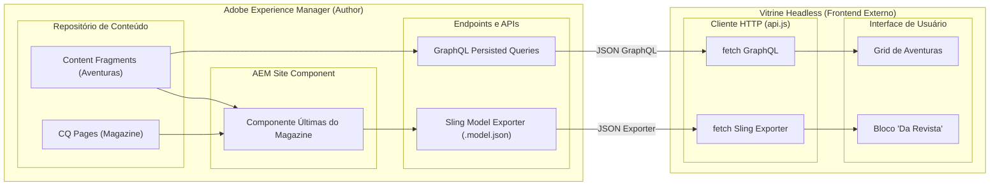

# WKND Omnichannel (Desafio Mestre) — O Ecossistema Completo

Arquitetura full-stack e omnichannel que unifica os mundos do **AEM (Backend tradicional + Headless)** e da **Vitrine Web (Frontend Desacoplado)**. Este desafio prova o verdadeiro poder do AEM ao fazer o conteúdo fluir bidirecionalmente: Fragmentos de Conteúdo alimentando componentes do site, e Componentes do site alimentando a aplicação externa via JSON Exporters.

---

## 1. Introdução e Visão Geral

### O Propósito do Desafio Mestre

O objetivo principal do **Desafio Mestre** é costurar as implementações das Semanas 7 e 8 em uma única experiência **Omnichannel**. O AEM deixa de ser apenas um renderizador de páginas ou apenas uma API GraphQL; ele se torna um motor híbrido.

1. O componente **Últimas do Magazine (7.2)** agora não exibe apenas as páginas de artigos, mas também consome os **Content Fragments de Aventuras (8.1)**, renderizando ambos lado a lado no próprio AEM.
2. A **Vitrine Headless (8.2)**, que antes só consumia as Aventuras via GraphQL, agora possui um bloco "Da Revista" que consome o **Sling Model Exporter JSON** gerado pelo componente Últimas do Magazine.

### O que foi desenvolvido

- **Polimorfismo no Backend (AEM)**: Criação da interface `OmnichannelCard` implementada pelos DTOs `MagazineArticle` e `AdventureCard`. Isso permitiu ao Sling Model `UltimasDoMagazineModelImpl` agrupar, mesclar e ordenar cronologicamente conteúdos de origens completamente diferentes (Páginas CQ e Content Fragments).
- **Otimização de Performance (Anti N+1)**: Refatoração no Sling Model para evitar múltiplas queries isoladas ao carregar dados de Instrutores anexados às aventuras.
- **Frontend Consumidor de Exporter (Vitrine)**: Implementação no `api.js` de um serviço robusto que consome o endpoint `.model.json` do componente AEM, tratando interceptações de segurança (HTML fallbacks) e injetando os cards da revista dinamicamente no DOM.
- **Layout Premium**: Padronização dos componentes visuais, com classes CSS reutilizáveis (`card.css`, `layout.css`, `state.css`), garantindo a mesma qualidade visual da vitrine original para os novos cards de magazine.
- **Flexibilidade de Autoria**: O `_cq_dialog.xml` do componente Últimas do Magazine agora permite que o autor configure não apenas o caminho das matérias, mas também o caminho das aventuras (`adventurePath`), dando controle total via Touch UI.

---

## 2. Objetivos e Critérios de Aceite

Abaixo estão listados os critérios estabelecidos para o Desafio Mestre:

- [x] **Componente "Últimas do Magazine" Híbrido:** O componente agora exibe as páginas mais recentes do magazine E as aventuras mais recentes lado a lado.
- [x] **Vitrine consumindo o Exporter JSON:** O frontend (Desafio 8.2) possui um novo bloco que consome o `.model.json` gerado pelo Sling Model do componente Últimas do Magazine.
- [x] **Conteúdo Fluindo nos Dois Sentidos:** Content Fragments entrando no site AEM (via componente) e Componentes do site alimentando o App externo (via JSON Exporter).
- [x] **Código Limpo e Otimizado:** Implementação de ordenação cronológica decrescente unificada e mitigação do problema de carga N+1 no AEM.
- [x] **Tratamento de Erros no Frontend:** A vitrine headless não quebra caso o endpoint do AEM devolva um fallback HTML de erro/segurança; ela exibe uma mensagem amigável no UI.

---

## 3. Arquitetura da Solução Omnichannel

O diagrama abaixo ilustra a comunicação cruzada e o fluxo bidirecional de dados.



---

## 4. Decisões Arquiteturais Fundamentais

### 1. Interface de Contrato Omnichannel (`OmnichannelCard`) no Backend
Para misturar `CQ Pages` (Artigos) e `Content Fragments` (Aventuras) na mesma lista sem quebrar o tipagem forte do Java, criamos a interface `OmnichannelCard`. Ela estipula métodos básicos como `getDate()`, `getTitle()`, e `getImagePath()`. Os DTOs `MagazineArticle` e `AdventureCard` implementam essa interface, permitindo que o Sling Model agrupe todos em uma única `List<OmnichannelCard>` e faça uma ordenação polimórfica (chronological sort decrescente) antes de devolver ao HTL ou exportar para JSON.

### 2. Tratamento Defensivo contra Fallbacks HTML no Frontend
O Sling Model Exporter às vezes pode ser bloqueado por configurações de segurança do AEM, retornando uma tela de login HTML com status `200 OK` (um comportamento padrão de interceptação).
**Decisão:** No `api.js`, implementamos uma verificação rigorosa do cabeçalho `Content-Type`. Se a resposta não for estritamente `application/json`, ou se a tentativa de `response.json()` falhar devido a sintaxe HTML, a vitrine captura o erro graciosamente e injeta um `state.css` informando ao usuário (e ao desenvolvedor) que a rota do Exporter não está pública ou requer configuração.

### 3. Remoção total de Inline CSS (SOLID no Frontend)
Para incorporar os novos cards da revista, refatoramos `components.js` e `index.html`, removendo qualquer rastro de `style="..."` inline. Tudo foi componentizado em `card.css`, `modal.css` e `layout.css`. Essa abordagem Premium e modular garante que a vitrine seja facilmente escalável e obedeça ao Princípio da Responsabilidade Única (SOLID) em sua camada visual.

### 4. Resolução de Consultas N+1 (AEM Models)
Buscar a aventura, e depois, para cada aventura, buscar o instrutor associado geraria o clássico problema N+1.
**Decisão:** O código foi refatorado (`UltimasDoMagazineModelImpl.java`) para otimizar essa carga, buscando as dependências de forma consolidada e mantendo a performance da renderização no AEM e no tempo de resposta do endpoint JSON.

### 5. Separação Visual via HTL (Preservação da API)
Apesar do backend gerar uma lista única polimórfica (misturando `MATERIA` e `AVENTURA`), houve a necessidade de separar a visualização no AEM Author em dois blocos distintos ("Últimas do Magazine" e "Aventuras Recentes").
**Decisão:** Ao invés de alterar o Java e quebrar a compatibilidade do JSON consumido pelo frontend, a separação foi feita de forma inteligente diretamente na camada de visualização (HTL). O script itera sobre a mesma coleção (`model.articles`) duas vezes, utilizando `data-sly-test="${article.type == 'MATERIA'}"` e `data-sly-test="${article.type == 'AVENTURA'}"` para construir seções distintas. Isso garantiu a melhoria visual para o autor do AEM sem afetar o contrato da API com a Vitrine.

---

## 5. Endpoints Utilizados na Vitrine

Além da comunicação nativa do AEM (HTL consumindo o Sling Model), a Vitrine agora consome dois endpoints complementares:

### 1. GraphQL (Aventuras)
```http
GET /graphql/execute.json/wknd/lista-aventuras HTTP/1.1
Host: localhost:4502
```

### 2. Sling Model Exporter (Revista)
```http
GET /content/wknd/us/en/jcr:content/root/container/container/ultimas_do_magazine.model.json HTTP/1.1
Host: localhost:4502
```
> *Nota: O path do componente pode variar dependendo de onde o autor inseriu o componente na página, mas a natureza de requisição é sempre a mesma: buscar a extensão `.model.json`.*

---

## 6. Como Executar o Projeto Localmente

### Pré-requisitos
1. **AEM 6.5 Author** rodando em `localhost:4502`.
2. Projeto AEM-Webjump devidamente buildado e feito deploy (`mvn clean install -PautoInstallSinglePackage`).
3. NodeJS instalado para rodar a Vitrine Headless.

### Passo a Passo

1. **Configurar o Componente no AEM:**
   - Acesse uma página no AEM (ex: a Homepage do WKND).
   - Insira o componente **Últimas do Magazine**.
   - No *Dialog* (Touch UI), configure o caminho das matérias e o caminho base dos fragments de Aventuras (`adventurePath`).
   
2. **Habilitar o CORS / Anon Access no AEM:**
   - Assegure-se de que a rota `.model.json` do seu componente esteja acessível via CORS (permissão na porta 8080) e não exija autenticação restrita que devolva HTML de fallback. (As configurações de Dispatcher/CORS de `f55bed2` já preveem o domínio localhost:8080).

3. **Rodar a Vitrine:**
   Abra o terminal na pasta raiz `vitrine-wknd/`:
   ```bash
   npx serve . -p 8080
   ```
4. **Visualizar:**
   Acesse `http://localhost:8080/`. Você verá o grid de aventuras e o novo bloco lateral/inferior contendo as **Últimas do Magazine**, provando a unificação Omnichannel.

---

## 7. Evidências Visuais

### 7.1 Vitrine Renderizando Aventuras + Magazine (Omnichannel)
> *Legenda: Frontend da vitrine exibindo simultaneamente as requisições GraphQL (Aventuras) e JSON Exporter (Artigos).*
> 

> *(Requisição Aventuras)*
> 

> *(JSON Exporter)*
> 


### 7.2 Dialog do AEM Híbrido
> *Legenda: Comprovação do campo de configuração de caminhos de aventura no dialog Touch UI do AEM.*
> 


### 7.3 HTL do Componente AEM Unificado
> *Legenda: Renderização nativa dentro do AEM Author exibindo os artigos de revista misturados polimorficamente com as aventuras, em ordem decrescente.*
> `
> 


### 7.4 Tratamento Defensivo (Falha do Exporter)
> *Legenda: Caso o Exporter retorne HTML de login por bloqueio de CORS, a UI exibe o fallback limpo e não "quebra" a aplicação.*
> 

> 
